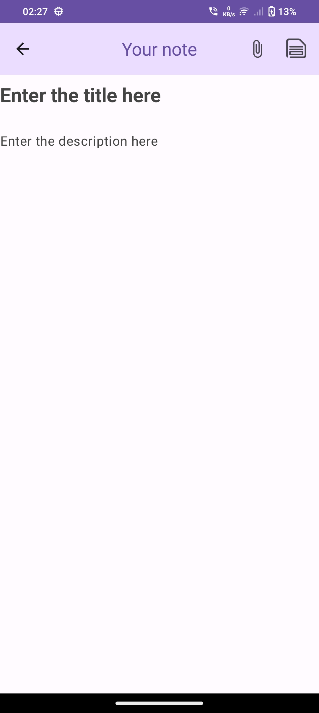

# Compose-Note 📝

Compose-Note is a simple note-taking app built with Jetpack Compose UI Toolkit. It offers an easy-to-use interface for capturing your thoughts, ideas, and memories. With features to add images, titles, and descriptions, Compose-Note keeps note-taking straightforward and efficient.

## Features ✨

- **Single Activity Design**: Experience a seamless navigation flow with a single activity architecture.
- **Offline Capability**: Take notes anytime, anywhere, with offline support for uninterrupted productivity. ✈️
- **Add Images to your notes**: Add and Delete images as you wish in your own notes. 🖼️
- **Restore Feature**: Safeguard your data with the ability to backup and restore your notes. 👀
- **Jetpack Compose UI**: Experience the latest in UI development with Jetpack Compose. 🖌
- **Switch Between Layouts**: Customize your note-taking experience by switching between different layouts. 🌟

## Built With 🛠

- **Kotlin**: First-class and official programming language for Android development.
- **Coroutines**: Asynchronous programming for efficient handling of background tasks.
- **Jetpack Compose UI Toolkit**: Modern UI development toolkit for building native Android UIs.
- **Android Architecture Components**:
  - **LiveData**: Data objects that notify views when the underlying database changes.
  - **ViewModel**: Stores UI-related data that isn't destroyed on UI changes.
  - **Room**: Android ORM library for SQLite database management.
- **StateFlow and SharedFlow**: Flow APIs for emitting state updates and values to multiple consumers.
- **Dependency Injection**:
  - **Hilt-Dagger**: Standard dependency injection for Android applications.
  - **Hilt-ViewModel**: Dependency injection for ViewModel.
- **Material Components for Android**: Modular and customizable UI components following Material Design guidelines.
- **Gson**: Java serialization/deserialization library for JSON handling.
- **Coil**: Image loading library backed by Kotlin Coroutines.

## Architecture 👷‍♂️

Compose-Note follows the MVVM (Model-View-ViewModel) architecture pattern, providing a robust and maintainable structure for the app.

# App Screenshots 📱

| Screenshot 1 | Screenshot 2 | Screenshot 3 | Screenshot 4 |
|:-------------:|:-------------:|:-------------:|:-------------:|
|  |  |  |  |

| Screenshot 5 | Screenshot 6 | Screenshot 7 | Screenshot 8 |
|:-------------:|:-------------:|:-------------:|:-------------:|
|  |  |  |  |
